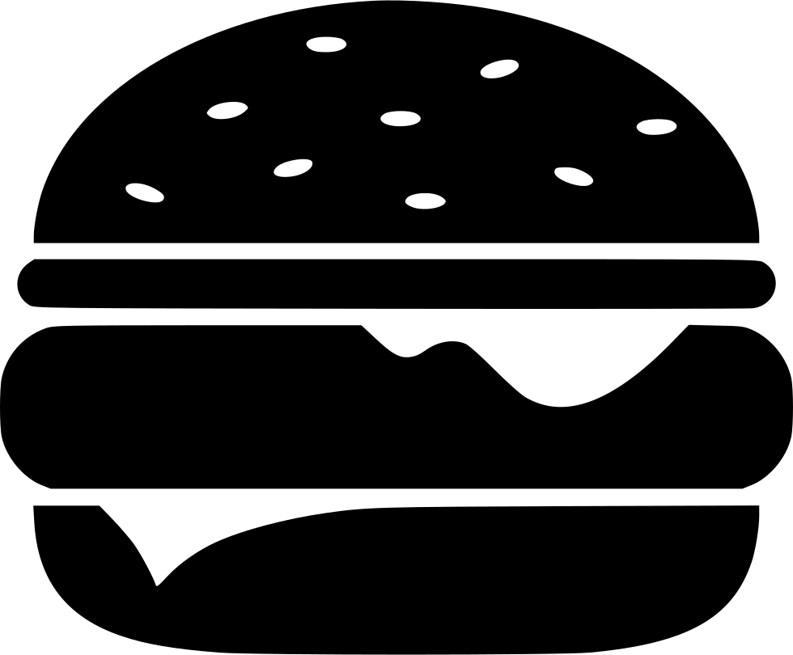

<h1 align="center">
  
</h1>

# Template landing page de lanchonete.

<p align="center">
  <a href="https://github.com/nataxaa">
    
  </a>

  <a href="#">
    
  </a>

  <a href="https://github.com/nataxaa/food-ReactJS/commits/master">
    
  </a>

  <a href="#">
    
  </a>

</p>

<br />

## 💻 Projeto

Projeto de template de uma lanchonete feito em ReactJS com TypeScript
<br />

## 🌐 Preview

<h1 align="center">
    
</h1>

## 🚀 Tecnologias

Esse projeto foi desenvolvido com as seguintes tecnologias:

- [React](https://react.dev/)
- [Typescript](https://www.typescriptlang.org/)
- [Styled Components](https://styled-components.com/)

<br />

## 🔥 Instalação
```bash
$ yarn
$ npm start
```
<br/>

## ⛅

- [Deploy](https://golden-bunny-32bdc4.netlify.app/)

<p align="center">
  Made with 💙 by <a href="https://www.linkedin.com/in/natan-xavier-a266a0228/"> Natan Xavier </a>
</p>
